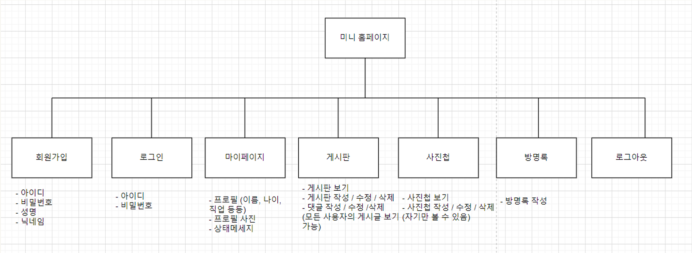

2023 2학기 정규 과목 JSP 프로젝트

# 미니 홈페이지 프로젝트

## 📋 프로젝트 소개
사용자의 소소한 일상들을 기록하고 저장하는 미니홈페이지 프로젝트입니다. 사용자의 경험과 추억을 웹사이트로 구축하여 소중한 순간을 영구적으로 기록할 수 있습니다. 사용자 정보, 게시물, 댓글 등의 데이터를 관리하기 위해 데이터베이스를 활용하였습니다.

## 🔍 시스템 구성도

## ⚙️ 개발 환경
- **운영체제**: Windows 10
- **개발 도구**: Eclipse IDE
- **JDK 버전**: JDK 20 이상
- **데이터베이스**: MySQL
- **서버**: Apache Tomcat

## 🔧 기술 스택
- **Backend**: Java, JSP, Servlet
- **Frontend**: HTML, CSS, JavaScript
- **Database**: MySQL
- **Design Pattern**: MVC Pattern
- **인증 방식**: Session 기반 인증
- 
## 🛠 주요 기능
### 1. 사용자 관리
- **회원가입**
  - 아이디, 비밀번호, 성명, 닉네임 입력
  - 중복 아이디 확인
- **로그인/로그아웃**
  - 세션 기반 사용자 인증
  - 로그아웃 시 세션 종료

### 2. 마이페이지
- 프로필 정보 관리 (이름, 나이, 직업 등)
- 프로필 사진 업로드
- 상태메시지 설정

### 3. 게시판
- 게시글 CRUD 기능
- 댓글 작성/수정/삭제
- 전체 사용자 게시물 조회

### 4. 사진첩
- 사진 업로드/수정/삭제
- 사진 설명 추가
- 댓글 기능

### 5. 방명록
- 방명록 작성
- 방명록 관리

---
